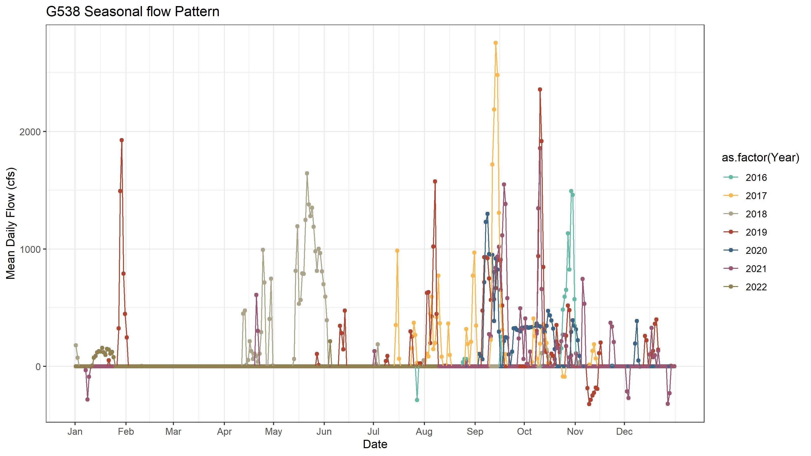
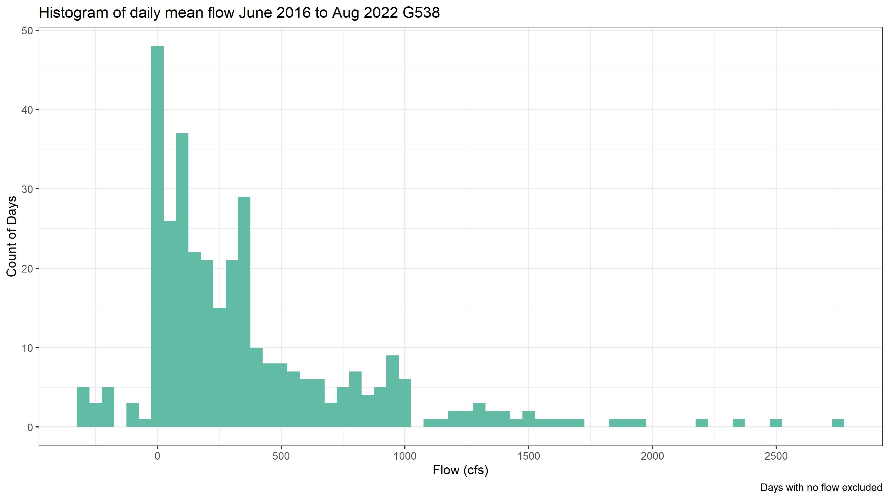
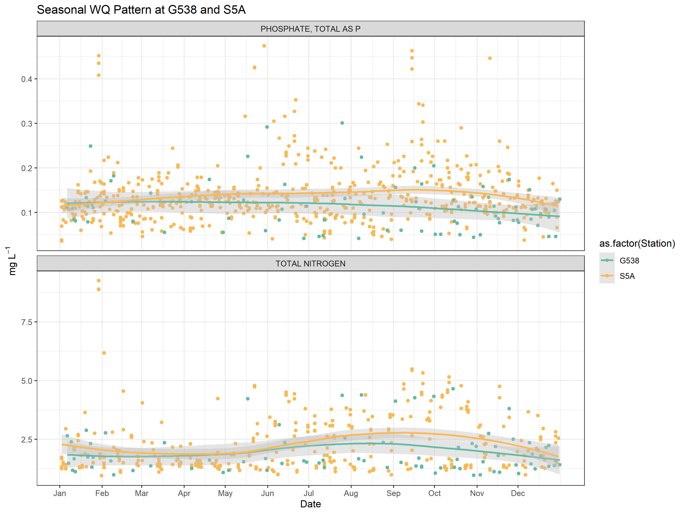
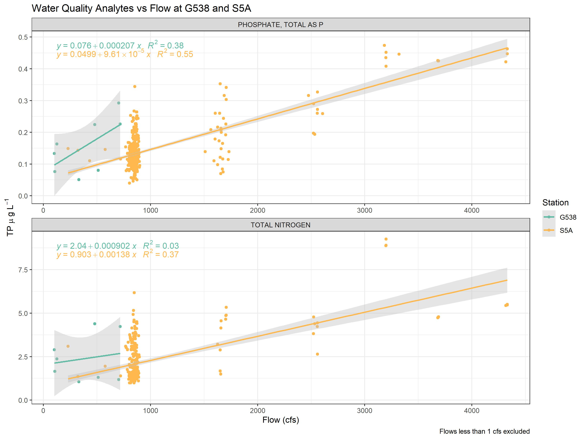

```{r setup, include=FALSE}
knitr::opts_chunk$set(echo = TRUE)
library(kableExtra)
```

## Objective

The objective of this report is to quantify the relationship between flow and the water quality analytes Total Phosphorus and Total Nitrogen. 

###Background

A little background summary of flow and water quality data from G538 and S5A and some of my thoughts. Compared to S5A there fewer days of flow at G538 (Table 1) which leads me to believe that the FEB is relatively underutilized.For most years the majority of flow occurs from September to October(Fig 1). On days when flow occurs at S5A the average flow is greater than what the FEB receives on days that flow occurs. It looks like the FEB has the ability to receive some of this S5A discharge should the FEB have volumetric capacity. Obviously, this is very rudimentary look at flow so I am excited to see if we can gain any insight into this issue from the hydrodynamic model. 


```{r Table 1, echo=FALSE }
knitr::kable(Summary_stats,caption = "Table 1: Summary Stats of G538 and S5A") %>% kable_material(c("striped", "hover"))
```


``` {r figure_1, echo=FALSE, fig.cap="Figure 1"}

```

Most flow through G538 is relatively low, less than 1000 cfs (Fig 2). There are a few higher flow rate events but these appear short in duration (fig 1).Also there are several reverse flow events (fig 2 and table 1). Will the low flow rates cause a problem with mixing?  

```{r figure_2, echo=FALSE, fig.cap="Figure 2"}

```

Descriptive stats for TP and TN values at G538 and S5A are fairly similar (Table 2) which is to be expected as S5A is major contributor to the FEB. S5A has slightly higher average values for both analytes.A possible function of higher flow rates at S5A?

```{r Table 2, echo=FALSE}
knitr::kable(Summary_stats_WQ,  caption = "Table 2: TP and TN Summary") %>% kable_material(c("striped", "hover"))

```

There is little seasonal variation in TP (Fig 3) at G538 or S5A. TN does exhibit a seasonal pattern with higher average values during wet-season. 

```{r figure_3, echo=FALSE, fig.cap="Figure 3"}

```

###Effect of Flow on Water Quality    

There is a moderate degree of association between flow and TP at G538 and S5A (fig 4). The 95% confidence interval for G538 is large likely due to the low sample number and limited flow range at G538 we have data for. Although we know G538 has inflow values higher than 1000 cfs numerous days (fig 1) these high flow events have not been sampled at the time they were flowing. The reason fro this is compliance samples are required to be collected within two weeks of a flow at G538; these high flow events are often short and over by the time samplers get to G538 to collect. S5A has many more samples and a greater range of flows which makes for a much tighter confidence interval and higher R squared. 


```{r figure_4, echo=FALSE, fig.cap="Figure 4"}

```

```{r Table 3, echo=FALSE}

S5A_model %>%
  tidy() %>% 
  kable( caption = "S5A model (TP~Flow) with all data included") %>% 
  kable_material(c("striped", "hover"))

S5A_model_greater_than_one %>%
  tidy() %>% 
  kable( caption = "S5A model (TP~Flow) Only flows >1cfs included") %>% 
  kable_material(c("striped", "hover"))


```
