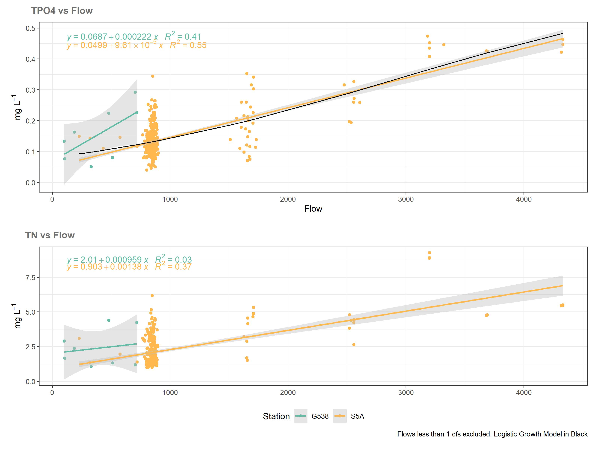

```{r setup, include=FALSE}
knitr::opts_chunk$set(echo = TRUE)
library(kableExtra)
```

## Objective

The objective of this report is to quantify the relationship between flow and the water quality analytes Total Phosphorus and Total Nitrogen. 

## Background

A little background summary of flow and water quality data from G538 and S5A and some of my thoughts. For most years the majority of flow occurs from September to October(Fig 1). Compared to S5A there are far fewer days of flow at G538 (Table 1, fig 1) which leads me to believe that the FEB is relatively underutilized. 

```{r Table 1, echo=FALSE }
knitr::kable(Summary_stats,caption = "Table 1: Summary Stats of G538 and S5A") %>% kable_material(c("striped", "hover"))
```


``` {r figure_1, echo=FALSE, fig.cap="Figure 1"}

```

Most flow through G538 is relatively low, less than 1000 cfs (Fig 2). Days with no flow were excluded as they were so numerous that when displayed the other flow classes were indistinguishable. There are a few higher flow rate events but these appear short in duration (fig 1).Also there are several reverse flow events (fig 2 and table 1). You mentioned in in our last meeting that mixing might be an issue at low flow rates so this might be a concern. 

```{r figure_2, echo=FALSE, fig.cap="Figure 2"}

```

Descriptive stats for TP and TN values at G538 and S5A are fairly similar (Table 2) which is to be expected as S5A is major contributor to the FEB. S5A has slightly higher average values for both analytes. A possible function of higher flow rates at S5A?

```{r Table 2, echo=FALSE}
knitr::kable(Summary_stats_WQ,  caption = "Table 2: TP and TN Summary") %>% kable_material(c("striped", "hover"))

```

There is little seasonal variation in TP (Fig 3) at G538 or S5A. TN does exhibit a seasonal pattern with higher average values during wet-season. 

```{r figure_3, echo=FALSE, fig.cap="Figure 3"}
knitr::include_graphics("./Figures/Seasonal WQ Pattern.jpg")
```

## Estimated Effect of Flow on TP and TN    

In the linear regression models between Flow and TP at G538 and S5A (fig 4) flow explains a moderate amount (r^2 of .38 and .55) of the variation in the data.  The 95% confidence interval for G538 is large likely due to the low sample number and limited flow range at G538 we have data for. Although we know G538 has inflow values higher than 1000 cfs numerous days (fig 1) these high flow events have not been sampled at the time they were flowing. The reason for this is compliance samples are required to be collected within two weeks of a flow at G538, and these high flow events are often short and over by the time samplers get to G538 to collect. S5A has many more samples and a greater range of flows which makes for a much tighter confidence interval and higher R squared.  Flow also looks to explain some of the variation in TN although this is not as strong and at G538 there is no relationship between flow and TN but I think this is attribute to the lack of data points at G538. Also it appears that Flow vs TP relationship is not linear leveling off around 3000 cfs at S5A. I attempted to create a logistic growth model that would better fit the data (not shown on fig 4). From the diagnostic plots below I think it does a slightly better job at creating an unbiased model and reducing heteroscedasticity . I've included model summaries and model diagnostics plots below for all the models. I don't know if the benefit of a non-linear logistic growth model would be worth the additional complexity but I thought it would be worth exploring. As someone who only dabbles in modeling I would be interested in hearing what some of your folks that have greater modeling expertise think.     

```{r figure_4, echo=FALSE, fig.cap="Figure 4"}

```

### Model Summaries


```{r Table 3: Model summaries, echo=FALSE}

knitr::kable(All_mods,  caption = "Table 2: TP and TN Summary") %>% kable_material(c("striped", "hover"))


```

### Model Diagnostic plots TP

```{r figure_5, echo=FALSE, fig.cap="Figure 5: S5A TP Model All Data Points"}
plot(S5A_model)
```

```{r figure_6, echo=FALSE, fig.cap="Figure 6: S5A TP Model Flow above 1cfs"}
plot(S5A_model_greater_than_one)
```

```{r figure_7, echo=FALSE, fig.cap="Figure 7: S5A TP logistic growth model Flow above 1cfs"}
plot(nlsResiduals(S5A_model_growth), which = 0) 
```

```{r figure_8, echo=FALSE, fig.cap="Figure 8: G538 TP Model All Data Points"}
plot(G538_model)
```

```{r figure_9, echo=FALSE, fig.cap="Figure 9: G538 TP Model Flow above 1cfs"}
plot(G538_model_greater_than_one)
```
### Model Diagnostic plots TN

```{r figure_10, echo=FALSE, fig.cap="Figure 10: S5A TN Model All Data Points"}
plot(S5A_model_TN)
```

```{r figure_11, echo=FALSE, fig.cap="Figure 11: S5A TN Model Flow above 1cfs"}
plot(S5A_model_greater_than_one_TN)
```

```{r figure_12, echo=FALSE, fig.cap="Figure 12: G538 TN Model All Data Points"}
plot(G538_model)
```

```{r figure_13, echo=FALSE, fig.cap="Figure 13: G538 TN Model Flow above 1cfs"}
plot(G538_model_greater_than_one)
```


